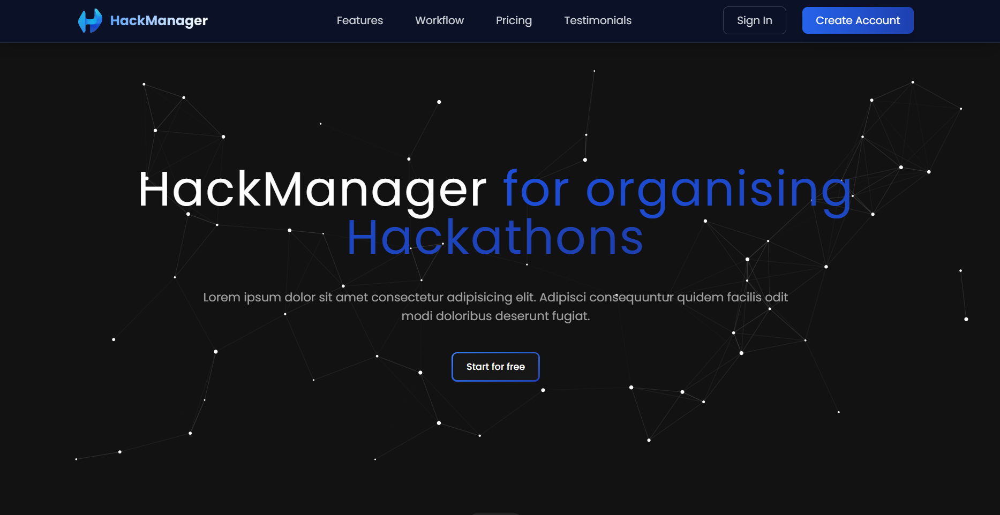
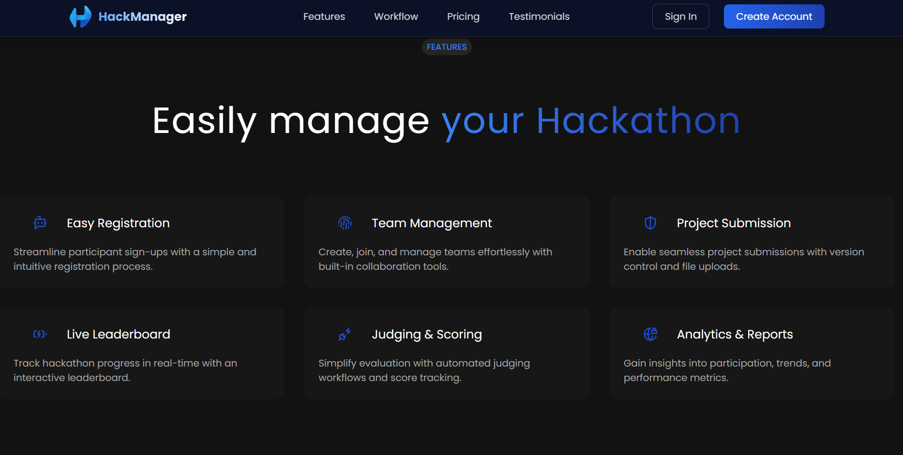
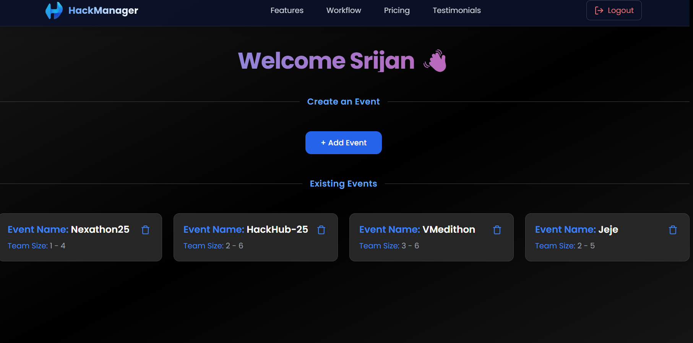
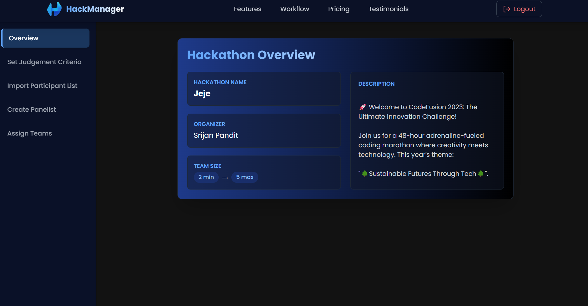
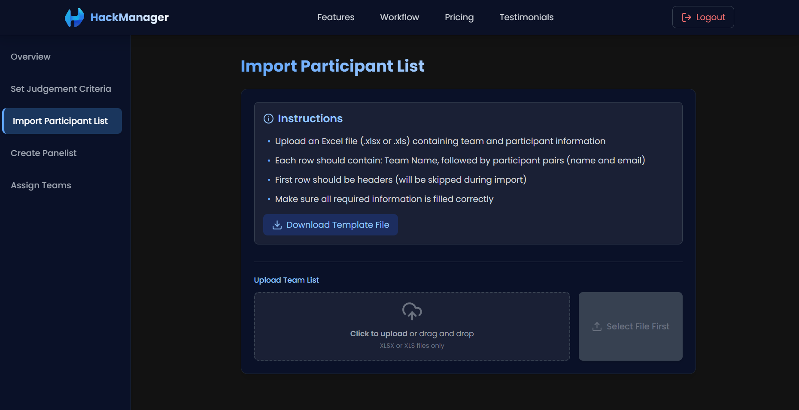

# 🚀 HackManager

**The ultimate platform for organizing and managing hackathons with ease.**

---

## 💪Made By💪

-  **Srijan Pandit**
-  **Dhruv Gadre**

---

---

## ✨ Features

- 👩‍💼 **Panelist Login** — Dedicated access for judges to evaluate projects
- 🎯 **Host Login** — Create and manage hackathons with complete control
- 📊 **Management Dashboard** — Award and view marks in real-time
- 📁 **Bulk Import** — Upload Excel files to add teams automatically
- 👥 **Team Management** — Organize participants effortlessly
- 📱 **Responsive Design** — Works flawlessly across all devices
- 🎨 **Modern Interface** — Built with Tailwind CSS for a sleek experience

---

## 📸 Preview

> Live demo coming soon!

---

## 🛠️ Tech Stack

| Tech            | Description                               |
| --------------- | ----------------------------------------- |
| ⚛️ React JS     | Frontend Framework & UI                   |
| 💨 Tailwind CSS | Styling and Responsive Design             |
| 🐻 Zustand      | Lightweight State Management              |
| 🟢 Node.js      | Backend Runtime Environment               |
| 🚂 Express.js   | Backend API Framework                     |
| 📊 Excel Import | Team data processing for bulk management  |

---

## 💻 System Architecture

HackManager operates on a full-stack architecture:

- **Frontend**: React-based responsive interface with Tailwind styling
- **Backend**: Node.js and Express handling authentication, data management, and Excel processing
- **User Roles**: Separate dashboards and permissions for hosts and panelists
- **Data Flow**: Seamless communication between frontend and backend via RESTful APIs

---

## 🎯 For Hackathon Organizers

HackManager was built specifically for hackathon hosts who need:

- An organized way to manage multiple events
- Efficient team registration processes
- Streamlined judging workflows
- Centralized scorekeeping and results
- An elegant interface for all users

Whether you're running a small college hackathon or a large-scale event, HackManager provides the tools to make your hackathon a success!

---

## 🔮 Coming Soon

- 📊 Advanced analytics dashboard
- 🌐 Public-facing landing pages for each hackathon
- 📱 Mobile app companion
- 🤝 Participant networking features
- 🏆 Customizable achievement badges
